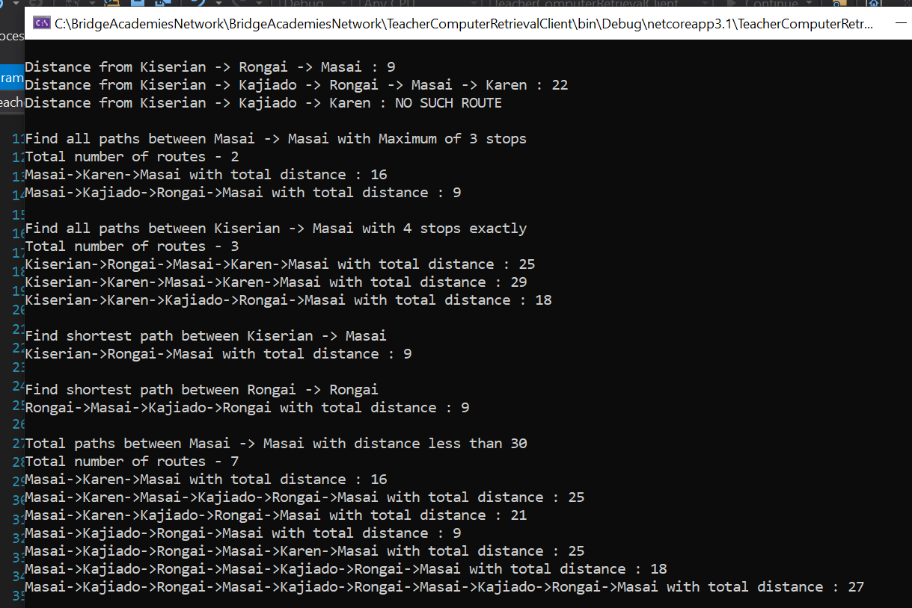
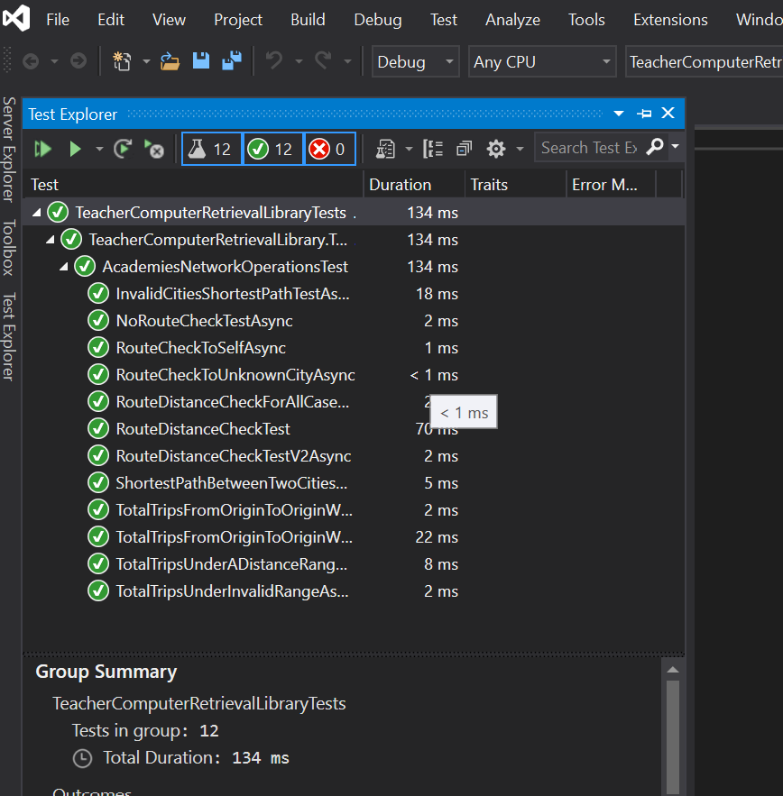

# Teacher Computer Retrieval Application
This application helps in getting route details between academies to aid the teacher computer retrieval by the IT team. Application uses concepts and algorithms including Generics, Recursion, DFS (depth first search), TSP with adjacency list etc. to complete the features mentioned below.

## Features

* Finds distance along certain routes.
* Gets the number of different routes between two academies along with various stop constraints.
* Gets the number of different routes between two academies with contraint on distance to be covered.
* Gives shortest route between two academies.

## Assumptions
* The distance between two academies is considered an integer.
* The routes defined have one-way traffic, the routes are defined in a single direction – a direct route from "A" to "B" does not imply   the existence of a direct route from "B" to "A". If both of these routes do happen to exist, they are distinct and are not necessarily   the same distance.
* If no route exists between two academies, the output given is 'NO SUCH ROUTE'

## Getting Started

### Prerequisites

* Visual Studio 2019
* .Net Core Framework 3.1
* MSTest Framework 2.0

### Installing

```
git clone https://github.com/rohitpant55/TeacherComputerRetrieval
cd TeacherComputerRetrieval
TeacherComputerRetrieval.sln
```

## Project structure
* TeacherComputerRetrievalLibrary is a library comprising of the various route operations business logic.
* TeacherComputerRetrievalClient consumes the TeacherComputerRetrievalLibrary to call the route operations with given inputs.
* TeacherComputreRetrievalLibraryTests contains the test cases for the TeacherComputerRetrievalLibrary project.

## Tests

```
Right click on TeacherComputreRetrievalLibraryTests and click on Run Tests
```
You will be able to see the tests status on the Test Explorer.

## Example
### TeacherComputerRetrievalClient project in the solution is used to create a real world example with connected cities and different operations are perfromed on the network


### Successful execution of test cases


## References

* https://www.c-sharpcorner.com/article/mstest-v2-how-it-differs/
* https://en.wikipedia.org/wiki/Travelling_salesman_problem
* https://iq.opengenus.org/graph-representation-adjacency-matrix-adjacency-list/


